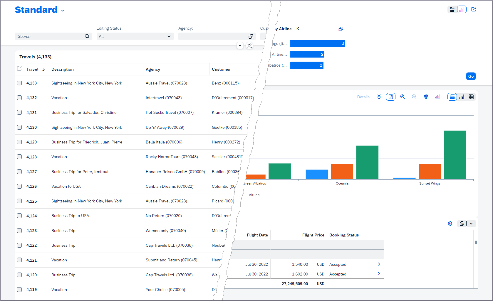

# Welcome to the CAP SFLIGHT App

This is a sample app for the travel reference scenario, built with the [SAP Cloud Application Programming Model (CAP)](https://cap.cloud.sap) and [SAP Fiori elements](https://experience.sap.com/fiori-design-web/smart-templates).

The purpose of this sample app is to:
* Demonstrate SAP Fiori annotations
* Demonstrate and compare SAP Fiori features on various stacks (CAP Node.js, CAP Java SDK, ABAP)
* Run UI test suites on various stacks



Currently the app is only available for the CAP Node.js stack. A version for CAP Java SDK will follow soon.

The app still contains some workarounds that are going to be addressed over time.
In some cases, the model and the handlers can be improved or simplified once further planned CAP features become available.
In other cases, the app itself could be improved. For example, calculation of the total price for a travel
currently simply sums up the single prices ignoring the currencies.


[](https://api.reuse.software/info/github.com/SAP-samples/cap-sflight)


## SAP Fiori UI with Node.js Backend

### Build and Run

1. In a console, execute `npm ci` in the root folder of your project.
2. In a console, execute `cds watch` in the root folder of your project.

### Accessing the SAP Fiori App

Open this link in your browser:
http://localhost:4004/travel_processor/webapp/index.html

### Integration Tests

To start OPA tests, open this link in your browser:
http://localhost:4004/travel_processor/webapp/test/integration/opaTests.qunit.html

Test documentation is available at:
https://ui5.sap.com/#/api/sap.fe.test

## Deployment to SAP Business Technology Platform

The project contains a configuration for deploying the CAP services and the SAP Fiori app to the SAP Business Technology Platform (BTP) using a managed application router. The app then becomes visible in the content manager of the SAP Launchpad service.

### Requirements
#### SAP Business Technology Platform
- Create a [trial account on SAP BTP](https://www.sap.com/products/business-technology-platform/trial.html). For more information, see [this tutorial](https://developers.sap.com/tutorials/hcp-create-trial-account.html). Alternatively, you can use a subaccount in a productive environment.
- Subscribe to the [SAP Launchpad service](https://developers.sap.com/tutorials/cp-portal-cloud-foundry-getting-started.html).
- Create a SAP HANA Cloud instance.
  
#### Local Machine
- Install the Cloud Foundry command-line interface. See [this tutorial](https://developers.sap.com/tutorials/hcp-create-trial-account.html).
- Install the [MultiApps CF CLI Plugin](https://github.com/cloudfoundry-incubator/multiapps-cli-plugin):
  ```shell
  cf add-plugin-repo CF-Community https://plugins.cloudfoundry.org
  cf install-plugin multiapps
  ```
- Install the [MTA build tool](https://github.com/SAP/cloud-mta-build-tool) globally:
  ```shell
  npm install -g mbt
   ```
### Build the project
Build the project from the command line:
```shell
mbt build
```
The build results will be stored in directory `mta_archives`.

### Deploy
1. Log in to the target space
2. Deploy the MTA archive using the CF CLI: `cf deploy mta_archives/capire.sflight_1.0.0.mtar`

## Creating a SAP Fiori App from Scratch

If you want to implement an SAP Fiori app, follow these tutorials:

* [Create a List Report Object Page App with SAP Fiori Tools](https://developers.sap.com/group.fiori-tools-lrop.html)
* [Developing SAP Fiori applications with SAP Fiori Tools](https://help.sap.com/viewer/17d50220bcd848aa854c9c182d65b699/Latest/en-US)

## Get Support

In case you've a question, find a bug, or otherwise need support, use the [SAP Community](https://answers.sap.com/tags/9f13aee1-834c-4105-8e43-ee442775e5ce) to get more visibility.

## License

Copyright (c) 2021 SAP SE or an SAP affiliate company. All rights reserved. This project is licensed under the Apache Software License, version 2.0 except as noted otherwise in the [LICENSE](LICENSE.txt) file.
